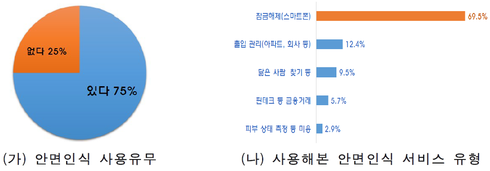
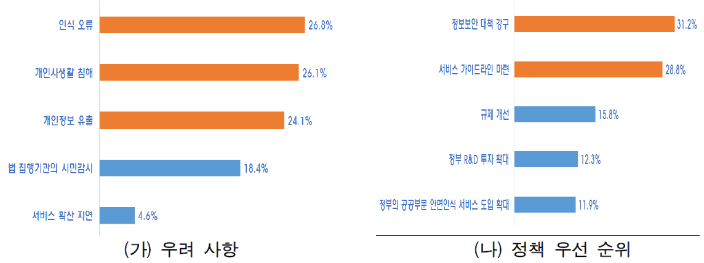
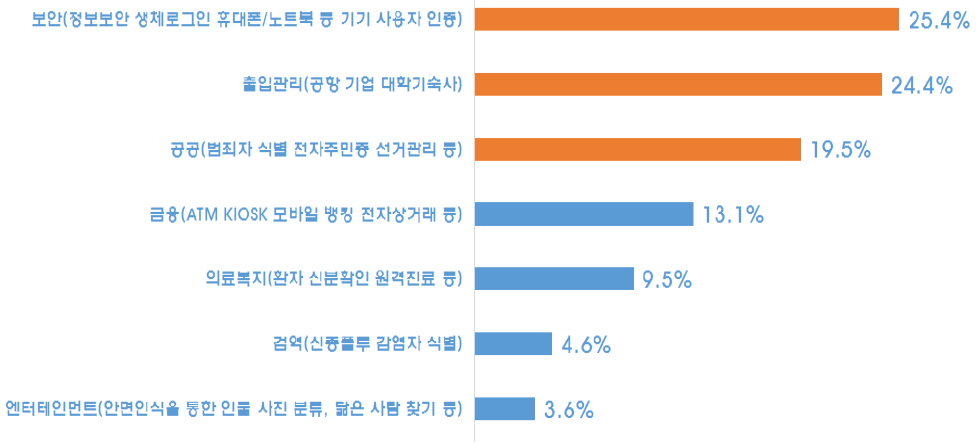

# 해외 주요 얼굴인식 솔루션

## 일본
- NEC사의 NEOFACE 응용프로그램
    - Generalized Learning Vector Quantization

## 독일
- Cognitec사의 FaceVACS 제품
    - B7T8
        - 이미지의 각도, 조명 등에 강점

## 미국
- L1 Identity Solutions사의 FaceIT 

## 중국
### 톈왕 ( 실시간 영상 감시 시스템 )
- 교통교차로, 공항/철도/항만을 비롯 29개의 성급행정구역에 배치
- 움직이는 사람도 식별
- 수만명의 대형 콘서트장에서 수배중인 범죄찾 식별가능(99.8%)
    - 현재 도심에 2000만대 이상의 초정밀 감시카메라 운용중
### 매의눈( Sharp Eyes ) 쉐량공정
- 감시카메라에 AI안면인식, 빅데이터 등의 첨단 ICT기술, 드론 등 항공감시 네트워크를 결합한 주민통제/관리 시스템 구축이 핵심
- 감시 카메라를 각 가정의 텔레비전이나 주민들의 스마트폰과 연결해 범죄 현장 등을 실시간으로 파악하는 용도로 활용
- 사천성의 경우 이미 쉐량공정 일환으로 1만 4,000개 마을에 4만 대 이상의 감시 카메라를 설치

### 광저우시와 광저우시 공안국은 중국에서 처음으로 안면인식 기능을 이용한 디지털 신분증 발급을 시작(’17.12월)
- 텐센트와 SNS ‘위챗’에서 안면인식으로 본인인증을 거친 후 스마트폰으로 발급받는 일종의 디지털 모바일 신분증
- 모바일 디지털 신분증을 발급받은 후 스마트폰으로 안면인식을 진행하면 공안부 신분증 데이터에 등록된 개인 신분증 사진과 단 몇 초 만에 자동 대조해 빠르고 편리하게 본인을 인증
- 중국 정부는 디지털 모바일 신분증 사용처를 간단한 인터넷 실명인증에서 호텔 숙박, 영업 등기 등으로 대폭 늘려나갈 방침

### 한편 중앙･지방정부가 AI기술이 접목된 최첨단 감시･추적 장비를 도입하면서 중국 정부의 안보예산이 크게 증가
- ’17년 안보 예산으로 1조 2,400억 위안을 지출했는데, 이는 정부예산의 6.1% 수준이며 국방예산보다 20%나 많은 금액(문화일보, ’18.3.7)​
- 안보예산은 톈왕･쉐량공정을 포함해 공안･무장경찰, 법원･검찰, 교도소 등의 운영비로 지출
- 이를 반영하듯 중국에는 1억 7,600만 대(‘16년)의 감시 카메라가 설치된 것으로 시장조사기관 IHS는 추정. 또한 감시 카메라 설치대수는 ’20년 4억 5,000만 대~약 6억 대까지 증가할 것으로 전망. 이처럼 수많은 감시 카메라에 AI 안면인식 시스템을 결합해 중국 정부는 누가, 어디서, 무엇을 하는지 실시간으로 추적할 수 있는 기반을 확보

### 항저우에 소재한 KFC에서는 안면인식 시스템을 활용, 제품 구매와 결제가 가능한 서비스를 도입(’17.9월)
- 고객 얼굴을 카메라가 인식･지불 완료까지 소요되는 시간이 단 8초에 불과해 신속･편리하며 매장 직원의 인건비를 절감하는 효과도 기대
- 한편 베이징 KFC에서는 안면인식을 통해 나이･성별과 기분에 따라 자체시스템이 햄버거 등 메뉴를 추천하는 기능으로까지 발전

### 선전･상하이 등 교통 혼잡에 시달리는 중국 대도시들도 교통질서를 바로잡기 위해 안면인식 전광판을 적극 활용하기 시작
- 선전의 교차로에 안면인식 카메라를 설치하고, 교통법규 위반 시 운전자 얼굴을 인식해 대형 스크린에 신원 공개
- 또한 횡단보도 신호를 어기고 건너다 감시 카메라에 찍히면 얼굴을 식별해 신원과 얼굴을 전광판에 띄우고 인터넷에도 공공연히 전시
- 안면 인식기를 설치한 산둥성 지난시에서는 설치 후 6,000여건의 횡단보도 위반을 단속(’17.5월
    - 안면 인식기(장치) 가격은 1대당 10만 위안(1,700만 원)이며 지난시 공안국은 ’17년 50개 주요 교차로에 안면 인식기를 설치
- 또한 기기 설치 뒤 하루 평균 횡단보도 위반건수가 200건 → 20건으로 감소
- 단속에 걸린 보행자는 20위안(약 3,427원)의 벌금과 30분의 교통 규칙 교육 또는 20분의 교통 봉사를 선택해 이행해야하는 벌칙을 부과

### 공항, 지하철
- 당국은 탑승권 등 종이서류가 필요 없이 통관이 가능한 스마트 공항 기술과 설비에 대한 연구도 진행
- 중국의 대규모 인구와 도시 집중, 이에 따라 발생하는 비효율을 해결하려는 의지가 지하철 안면인식 결제 시스템 도입을 확산하는 기폭제로 작용
    - 길게 줄을 서야 했던 불편을 해소하고 출입국 심사의 정확성･효율성을 제고
    - 역무원이 신분증과 기차표를 대조하던 과거 방식 대신 얼굴 스캔으로 3초 만에 신분을 확인
    - 선전시 지하철 당국도 푸톈역에서 얼굴 인식시스템을 실험(홍콩 사우스차이나모닝포스트, 19.3.13일)

### 정부의 초기 공공 발주가 안면인식 시장･산업 발전의 견인차 역할 수행
- 중국 정부의 적극적 안면인식 도입과 사회･경제적 측면에서의 활용 장려 분위기는 로컬기업들의 기술･서비스 경쟁우위 확보로 연결
- 중국은 개인정보보호 수준이 미국･유럽 등 선진국과 비교해 관대한 편이어서 관련 기업의 개인 정보 수집이 용이한 데다 중국의 거래한 13억 명의 데이터가 AI를 활용한 안면인식 기술력 제고에 일조
- 중국 정부의 공공 프로젝트 발주 등 예산 투입은 로컬 업체들이 안면인식 시장에서 AI 기술 등의 역량을 축적하는 기반으로 작용
- 무엇보다 안면인식 시스템이 경찰의 용의자 체포나 공공질서 위반 적발 등 치안뿐만 아니라 유통･금융 등 확대되면서 관련 산업 생태계 형성에 기여
- 이러한 여세를 몰아 자국에서 경쟁력을 확보한 중국 기업은 AI기반 안면인식 시스템을 앞세워 해외로까지 진출을 본격화하는 형국

## 한국
- 활용은 일부 서비스에 국한된 초기단계에 머물러 있는 수준
    - 잠금해제 이외에 출입관리(12.4%)  
    - 닮은 사람 찾기(9.5%)  
    - 금융 거래(5.7%) 등의 서비스 사용경험은 상대적으로 미약한 실정
    

- 안면인식 서비스 우려사항(중복 응답) / 안면인식 발전을 위한 정책 우선 순위 (중복 응답)
    - 
-  안면인식은 다양한 AI 기술 중 가장 활발하게 적용되는 분야지만, 국내는 개인정보 보호 규제 등으로 개발･실증 기회가 부족

### 국내 발전방향
- 다양한 분야에서 동시 다발적으로 안면인식을 도입하기보다 초기에는 보안(기기 사용자 인증)･출입관리･공공 등으로 영역을 좁히는 전략 필요
- 안면인식 서비스 중 가장 기대되는 서비스(중복 응답)
    
- 이러한 조사결과를 볼 때 초기에는 특정 영역에 집중하다가 기술발전과 이용자 우려를 해소하면서 점차 다양한 영역으로 확대하는 정책 추진 필요